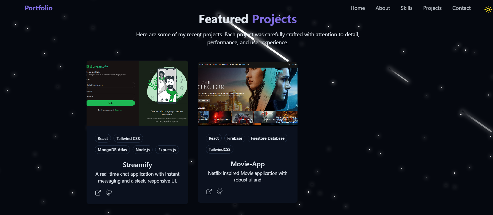

<h1 align="center">🌐 My Portfolio Website</h1>
<p align="center">A modern, responsive developer portfolio built with React, Tailwind CSS, and Vite.</p>


---

## 🚀 Overview

This is my personal developer portfolio showcasing my skills, projects, and contact information.  
It features a clean, responsive design with smooth animations, dark mode, and an interactive projects showcase.

**🔗 Live Demo:** [https://portfolio-website-jade-iota-26.vercel.app/]

---

## ⚙️ Tech Stack

- **Frontend:** React, Tailwind CSS, Vite  
- **UI Components:** Radix UI, Lucide Icons  
- **Deployment:** Vercel  

---

## ✨ Features

- 🌑 **Light/Dark Mode** with theme persistence  
- 📱 **Fully Responsive** design for all devices  
- 💫 **Smooth Animations** and interactive UI  
- 👨‍💻 **Projects Showcase** with GitHub/demo links  
- 📩 **Contact Section** with social links  

---

## 🖼️ Screenshots

### Home Page
<p align="center">
  
</p>

### Projects Page
<p align="center">
  
</p>

---

## ⚡️ Run Locally

```bash

cd portfolio
npm install
npm run dev
